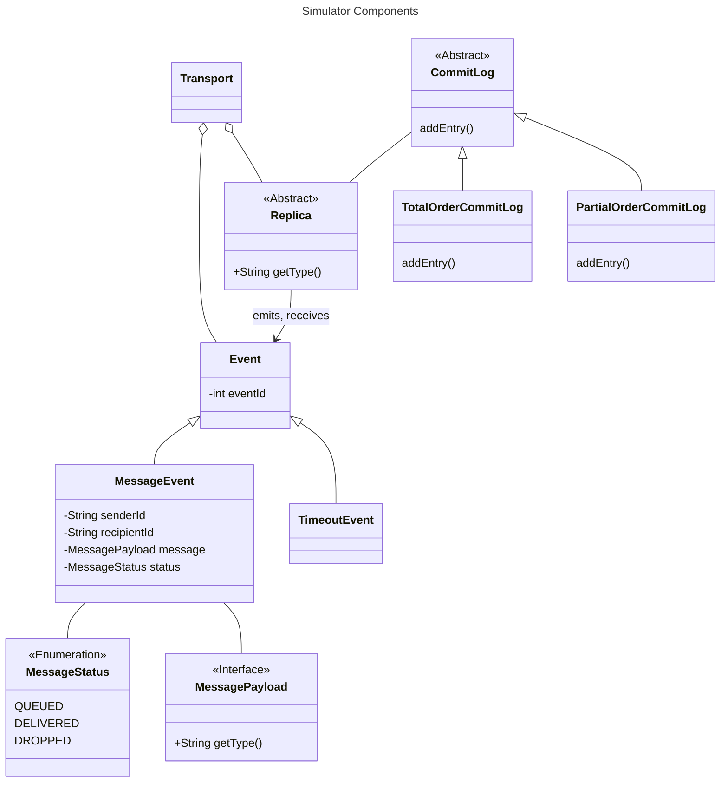

# ByzzBench

BFT Protocol Benchmarking Suite

This is a Gradle monorepo that contains the following modules:

- `simulator`: The core benchmarking suite. Currently also includes the protocol implementations.
- `webui`: A web interface for the benchmarking suite.

## Prerequisites

For the benchmarking suite to work, you need to have the following installed on your system:

- Java 21

For the user interface to work, you need to have the following installed on your system:

- Node.js
- pnpm

### MacOS

Installing everything on macOS using HomeBrew can be done with the following commands:

```
brew install openjdk@17 node pnpm
```

### Windows

Installing JDK:

1. Through Eclipse Adoptium:
    - Download the version you need (at least JDK-17)
    - When installing, select "Set or override JAVA_HOME variable"

2. Through Windows Package Manager - "winget":

```
// Eclipse Temurin from Eclipse Adoptium
winget install EclipseAdoptium.Temurin.17.JDK

// from Microsoft Build
winget install Microsoft.OpenJDK.17
```
> [!NOTE]
> You might need to set a PATH and JAVA_HOME!

To verify the installation execute the following in cmd (should match the installed version):

```
java -version
```
> [!NOTE]
> If it displays a different version, then the PATH or JAVA_HOME could be set incorrectly (pointing to another version)!

Installing Node.js:

1. Through installer: https://nodejs.org/en/download/prebuilt-installer
2. Through package managers: https://nodejs.org/en/download/package-manager

To install pnpm, you can use npm package manager (installed alongside Node.js):

```
npm install -g pnpm
```

or Corepack:

```
corepack enable pnpm
```

or PowerShell:

```
Invoke-WebRequest https://get.pnpm.io/install.ps1 -UseBasicParsing | Invoke-Expression
```
> [!WARNING]
> Windows Defender may block this option!
> 
> Using npm or Corepack is the recommended way!

Reference: https://pnpm.io/installation

For other operating systems, please refer to the respective installation instructions.

## Building

To install dependencies and build the benchmarking suite, run the following commands:

```
./gradlew build
(cd webui && pnpm install)
```

## Running

To run the benchmarking suite, run the following command:

```
./gradlew bootRun
```

## Web Interface

To run the web interface, run the following command:

```
(cd webui && pnpm run kubb:generate && pnpm run dev)
```

> [!NOTE]
> The simulator must be running for `kubb:generate` to succeed.

The UI should then be available at http://localhost:3000.

## Running Benchmarks

We currently have the following protocols implemented:

- ~~[PBFT](simulator/src/main/java/byzzbench/simulator/protocols/pbft/PbftReplica.java): The original PBFT protocol, as
  described in
  the [PBFT paper](https://www.microsoft.com/en-us/research/publication/practical-byzantine-fault-tolerance/);~~
- [PBFT-Java](simulator/src/main/java/byzzbench/simulator/protocols/pbft_java/PbftReplica.java): A buggy version of
  PBFT,
  from the [PBFT-Java repository](https://github.com/caojohnny/pbft-java);
- [Fast-HotStuff](simulator/src/main/java/byzzbench/simulator/protocols/fasthotstuff/FastHotStuffReplica.java): An
  unsuccessful attempt at improving the design of HotStuff, as described in
  the [Fast-HotStuff paper](https://arxiv.org/abs/2010.11454);

## Documentation

See additional documentation in the [docs](docs) directory.

- [Implementing new BFT Protocols](docs/implementing-protocols.md)
- [Reproducing Schedules](docs/reproducing-schedules.md)
- [User Interface](docs/user-interface.md)

## Simulator Structure


