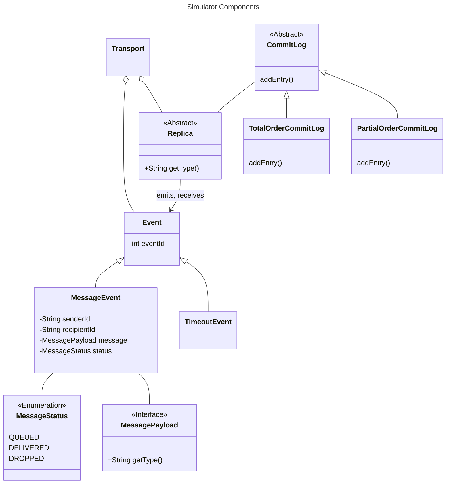

# ByzzBench

BFT Protocol Benchmarking Suite

This is a Gradle monorepo that contains the following modules:

- `simulator`: The core benchmarking suite. Currently also includes the protocol implementations.
- `webui`: A web interface for the benchmarking suite.

## Prerequisites

For the benchmarking suite to work, you need to have the following installed on your system:

- Java 21

For the user interface to work, you need to have the following installed on your system:

- Node.js
- pnpm

Installing everything on macOS using HomeBrew can be done with the following commands:

```
brew install openjdk@17 node pnpm
```

For other operating systems, please refer to the respective installation instructions.

## Benchmark Suite

To build and run the benchmarking suite, run the following command:

```
./gradlew bootRun
```

## Web Interface

The web UI is a simple React application (using NextJS/TypeScript) that allows you to interact with the simulator. It is
a work in progress, but provides useful insights into the behavior of the protocols.

To build the web interface, run the following command **while the simulator is running**:

```
(cd webui && pnpm install && pnpm run kubb:generate && pnpm run build)
```

> [!NOTE]
> The simulator must be running for `kubb:generate` to succeed.

The above command will generate the necessary TypeScript bindings for the simulator and build the web interface. You
only need to run it once.

Then, to start the web server, run the following command:

```
(cd webui && pnpm run start)
```

The UI should then be available at http://localhost:3000

## Running Benchmarks

We currently have the following protocols implemented:

- ~~[PBFT](simulator/src/main/java/byzzbench/simulator/protocols/pbft/PbftReplica.java): The original PBFT protocol, as
  described in
  the [PBFT paper](https://www.microsoft.com/en-us/research/publication/practical-byzantine-fault-tolerance/);~~
- [PBFT-Java](simulator/src/main/java/byzzbench/simulator/protocols/pbft_java/PbftReplica.java): A buggy version of
  PBFT,
  from the [PBFT-Java repository](https://github.com/caojohnny/pbft-java);
- [Fast-HotStuff](simulator/src/main/java/byzzbench/simulator/protocols/fasthotstuff/FastHotStuffReplica.java): An
  unsuccessful attempt at improving the design of HotStuff, as described in
  the [Fast-HotStuff paper](https://arxiv.org/abs/2010.11454);

## Documentation

See additional documentation in the [docs](docs) directory.

- [Implementing new BFT Protocols](docs/implementing-protocols.md)
- [Reproducing Schedules](docs/reproducing-schedules.md)
- [User Interface](docs/user-interface.md)

## Simulator Structure


