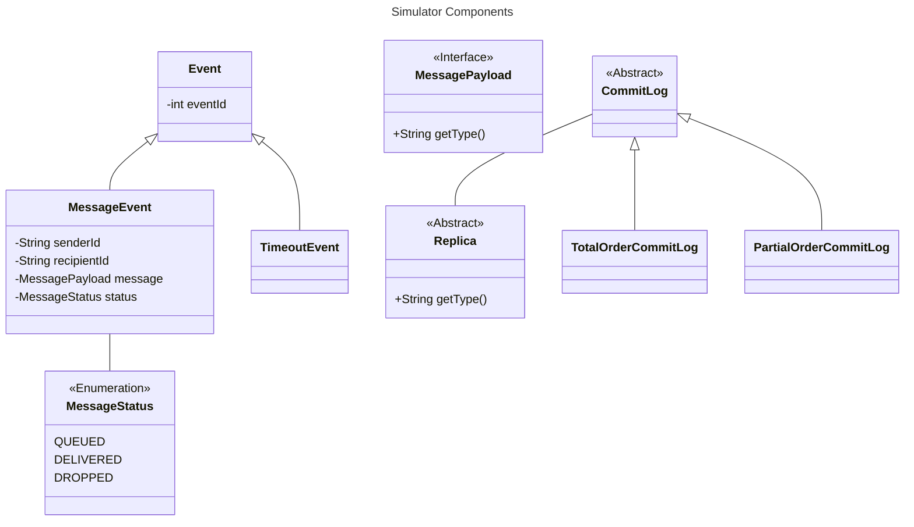

# ByzzBench

BFT Protocol Benchmarking Suite

This is a Gradle monorepo that contains the following modules:

- `simulator`: The core benchmarking suite. Currently also includes the protocol implementations.
- `webui`: A web interface for the benchmarking suite.

## Prerequisites

For the benchmarking suite to work, you need to have the following installed on your system:

- Java 21

For the user interface to work, you need to have the following installed on your system:

- Node.js
- pnpm

Installing everything on macOS:

```
brew install openjdk@17 node pnpm
```

## Building

To build the benchmarking suite, run the following command:

```
./gradlew build
```

## Running

To run the benchmarking suite, run the following command:

```
./gradlew bootRun
```

## Web Interface

To run the web interface, run the following command:

```
(cd webui && pnpm install && pnpm run kubb:generate && pnpm run dev)
```

The UI should then be available at http://localhost:3000.

## Documentation

- [Implementing new BFT Protocols](docs/implementing-protocols.md)

## Simulator Structure


