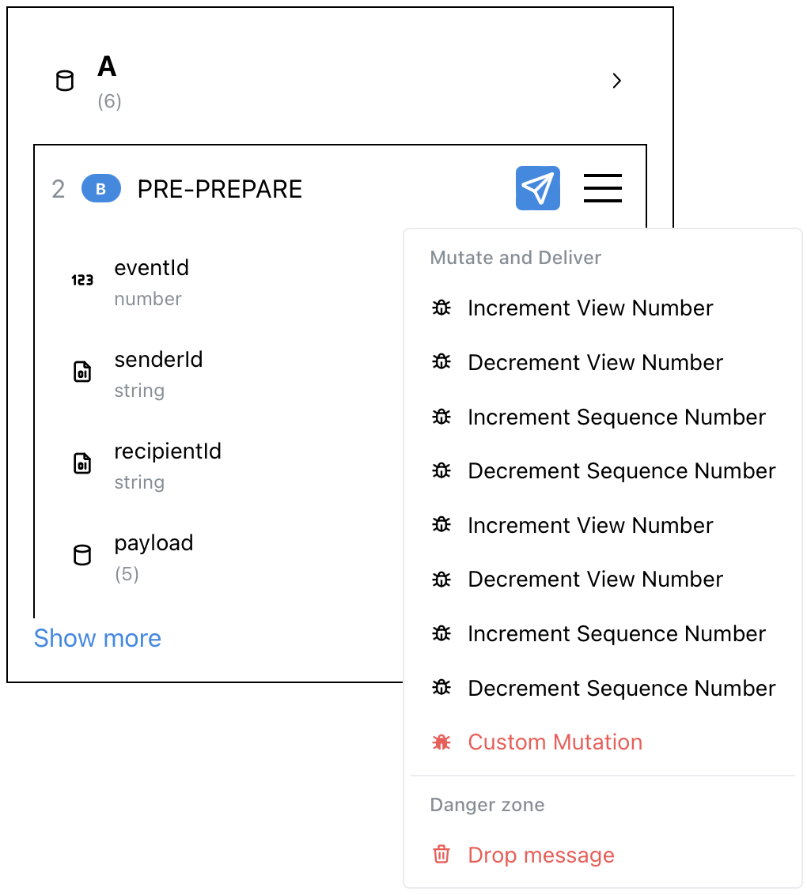

# Reproducing Schedules

The ByzzBench framework offers complete support for reproducing buggy schedules.

As executions are fully deterministic, replaying the same events in the same order will always produce the same result:

To simulate faults, the framework allows to, instead of delivering a message in a node's mailbox, to drop it, or apply
mutations to it. The latter approach is inspired by the [ByzzFuzz](https://dl.acm.org/doi/abs/10.1145/3586053) approach
to simulating
Byzantine faults.

In the future, schedules will be serialized by the framework, and the UI will include the functionality to reproduce
them.
