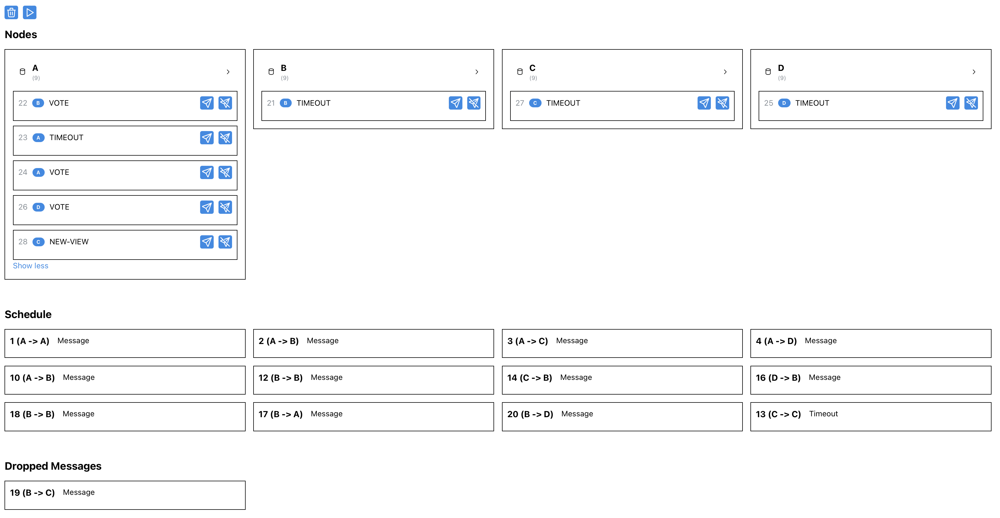
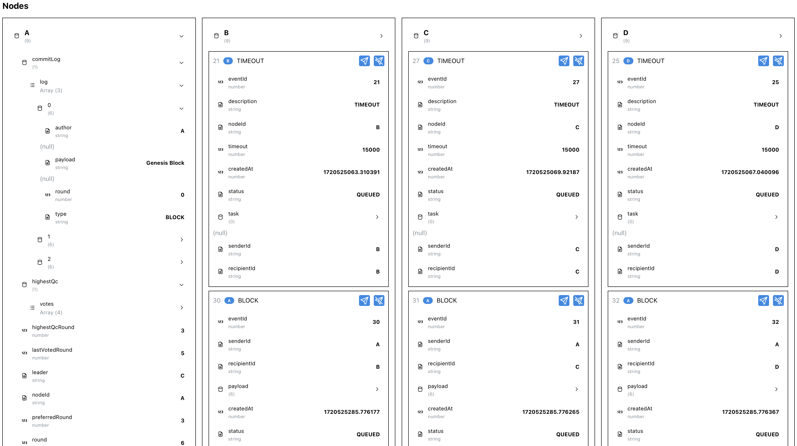

# User Interface

ByzzBench includes a user interface that allows to visualize and control the execution of the protocol.

In the top section, under *Nodes* we can see the state of each Replica, as well as the list of messages currently waiting to be delivered in their mailbox.

Under *Schedule*, we can see the events in the order they were delivered to their respective recipients. *Dropped Messages* displays the set of events that failed to be delivered.

The UI allows to introspect the state of each node and message:

